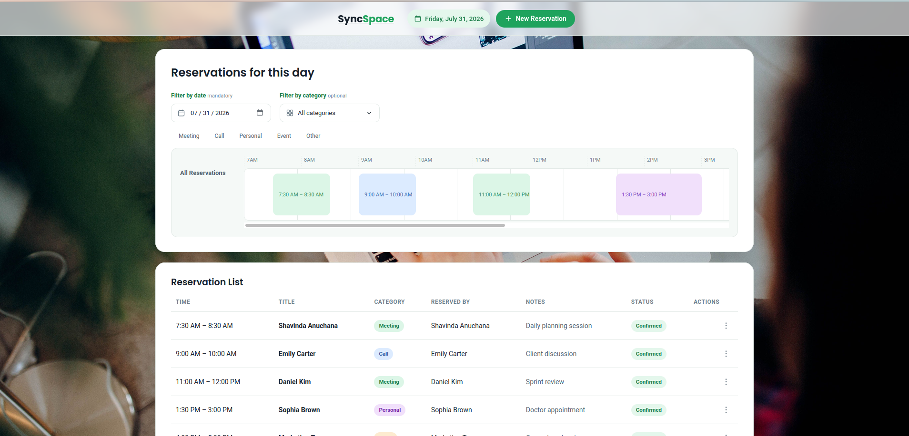
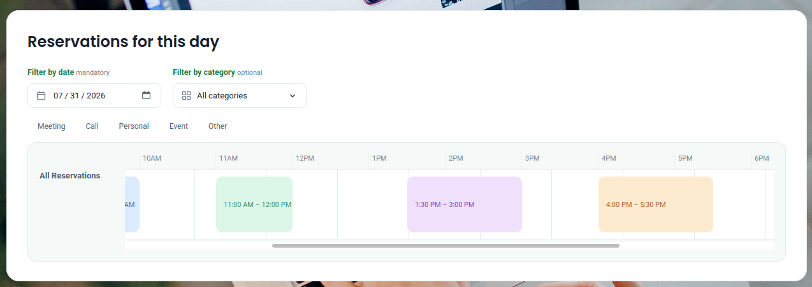
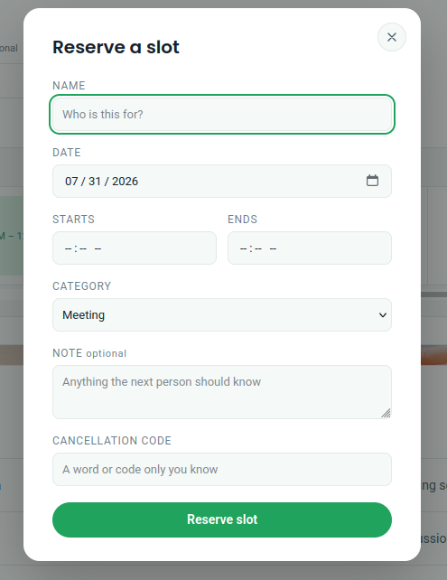

# SyncSpace

SyncSpace is a web-based reservation system for managing shared spaces and time slots. Users can create reservations, view daily schedules on an interactive timeline, filter bookings by category, and securely cancel reservations using a cancellation code.

---

## Live Demo

- **Frontend:** https://sync-your-space.vercel.app
- **Backend API:** https://syncspace-r05n.onrender.com

---

## Features

- Interactive daily reservation timeline
- Create new reservations
- Filter reservations by category
- View reservation details
- Secure cancellation with a cancellation code
- Prevent overlapping reservations
- Prevent booking past time slots
- Responsive user interface

---

## Tech Stack

### Frontend
- HTML5
- CSS3
- JavaScript (ES6)

### Backend
- FastAPI
- SQLModel
- Pydantic

### Database
- MySQL

### Deployment
- Vercel (Frontend)
- Render (Backend)

---

## Project Structure

```
rotract-booking-app/
│
├── frontend/
│   ├── index.html
│   ├── style.css
|   ├── background.jpg
│   └── app.js 
│
├── backend/
│   ├── main.py
│   ├── database.py
│   ├── models.py
│   └── requirements.txt
│
└── README.md
```

---

## Running Locally

### Clone the repository

```bash
git clone https://github.com/Anuchana/Mini-Web-app---Time-slot-Booking-app.git
cd     Mini-Web-app---Time-slot-Booking-app/rotract-booking-ap/backend
```

### Backend

```bash
python -m venv venv
```

Activate the virtual environment.

**Windows**

```bash
venv\Scripts\activate
```

**Linux/macOS**

```bash
source venv/bin/activate
```

Install dependencies.

```bash
pip install -r requirements.txt
```

Start the server.

```bash
uvicorn main:app --reload
```

### Frontend

Open `index.html` in your browser or use a simple local server.

---

## API Endpoints

| Method | Endpoint | Description |
|--------|----------|-------------|
| GET | `/api/bookings` | Retrieve reservations |
| POST | `/api/bookings` | Create a reservation |
| DELETE | `/api/bookings/{id}` | Delete a reservation |

---

## Reservation Rules

- Reservations cannot overlap.
- Past time slots cannot be reserved.
- End time must be after the start time.
- A valid cancellation code is required to delete a reservation.

---

## Frontend

## Home Page



## Timeline



## Booking Form



---

## Future Improvements

- User authentication
- Reservation editing
- Weekly and monthly calendar views
- Search functionality
- Email notifications

---

## License

This project is released for educational purposes.
